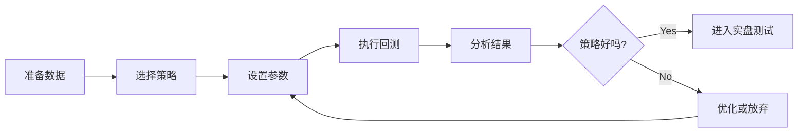

# 第 5 课：第一次策略回测

> 📚 **课程系列**：Freqtrade 量化交易完整教学课程
> 📖 **所属部分**：第二部分 - 回测实战
> ⏱ **课时**：2 小时
> 🎯 **难度**：⭐⭐ 初级

---

## 🎯 学习目标

完成本课后，你将能够：
- ✅ 理解什么是回测以及为什么要回测
- ✅ 掌握基础回测命令的使用
- ✅ 阅读和理解回测报告的各项指标
- ✅ 识别和解决常见的回测错误
- ✅ 评估策略是否值得进一步研究

---

## 📋 课前准备

### 必备条件
- [x] 已完成第 1-4 课的学习
- [x] Freqtrade 环境已安装并配置
- [x] 已下载至少 30 天的历史数据

### 验证环境
```bash
# 1. 激活环境
conda activate freqtrade

# 2. 验证版本
freqtrade --version
# 应显示：freqtrade 2025.9 或更高版本

# 3. 验证策略可用
freqtrade list-strategies -c config.json | grep Strategy001
# 应显示：│ Strategy001 │ Strategy001.py │ OK │

# 4. 验证数据已下载
freqtrade list-data -c config.json
# 应显示已下载的交易对和时间框架
```

如果任何一步出现问题，请返回相应课程复习。

---

## 📖 理论知识

### 5.1 什么是回测？

**回测（Backtesting）** 是使用历史数据模拟交易策略的过程，目的是评估策略在过去的表现。

#### 回测的工作原理

```
历史数据 → 策略逻辑 → 模拟交易 → 性能报告
    ↓          ↓          ↓          ↓
  K线数据   买卖信号   开平仓记录   收益统计
```

**举例说明**：
- 假设今天是 2025-09-30
- 我们用 2025-09-01 到 2025-09-30 的历史数据
- 模拟如果在这 30 天里运行策略会发生什么
- 统计盈亏、胜率、最大回撤等指标

#### 回测 vs 实盘的区别

| 维度 | 回测 | 实盘 |
|------|------|------|
| 数据 | 历史数据（已知） | 实时数据（未知） |
| 执行 | 瞬间完成 | 真实等待 |
| 滑点 | 可能忽略 | 真实存在 |
| 手续费 | 估算 | 真实扣除 |
| 心理 | 无压力 | 有情绪波动 |

⚠️ **重要提示**：回测好不代表实盘好，但回测差一定实盘差！

---

### 5.2 为什么要回测？

#### 5个关键原因

1. **验证策略逻辑**
   - 策略思路是否正确？
   - 买卖信号是否合理？

2. **评估盈利能力**
   - 能赚钱吗？赚多少？
   - 胜率如何？

3. **评估风险水平**
   - 最大回撤多少？
   - 能承受吗？

4. **优化参数**
   - 哪些参数效果更好？
   - 如何调整止损止盈？

5. **建立信心**
   - 策略经过验证才敢用真金白银

#### 回测的局限性

❌ **回测不能做的事**：
- 不能预测未来（历史不会完全重演）
- 不能消除所有风险
- 不能替代实盘验证

✅ **回测能做的事**：
- 快速筛选策略
- 发现明显的问题
- 提供优化方向

---

### 5.3 回测的基本流程



---

## 💻 实践操作

### 5.4 第一次回测命令

#### 命令结构

```bash
freqtrade backtesting \
  -c config.json \                    # 配置文件
  --strategy Strategy001 \            # 策略名称
  --timerange 20250901-20250930       # 时间范围
```

#### 逐步执行

**步骤 1：激活环境**
```bash
conda activate freqtrade
cd /path/to/freqtrade-strategies
```

**步骤 2：验证数据**
```bash
# 确保已下载数据
freqtrade list-data -c config.json

# 输出示例：
# BTC/USDT  5m  2025-09-01 -> 2025-09-30
# ETH/USDT  5m  2025-09-01 -> 2025-09-30
```

**步骤 3：执行回测**
```bash
freqtrade backtesting \
  -c config.json \
  --strategy Strategy001 \
  --timerange 20250901-20250930
```

#### 执行过程说明

回测开始后，你会看到类似这样的输出：

```
2025-09-30 16:00:00 - freqtrade - INFO - freqtrade 2025.9
2025-09-30 16:00:01 - freqtrade.configuration - INFO - Using config: config.json ...
2025-09-30 16:00:02 - freqtrade.exchange - INFO - Using Exchange "Binance"
2025-09-30 16:00:03 - freqtrade.optimize.backtesting - INFO - Loading data from 2025-09-01 to 2025-09-30
2025-09-30 16:00:04 - freqtrade.optimize.backtesting - INFO - Running backtesting for Strategy Strategy001
```

**执行时间**：
- 1 个月数据：约 5-30 秒
- 3 个月数据：约 30-60 秒
- 1 年数据：约 2-5 分钟

---

### 5.5 回测报告完整解读

回测完成后，会显示多个表格。让我们逐一解读：

#### 📊 表格 1：BACKTESTING REPORT（核心报告）

```
                               BACKTESTING REPORT
┏━━━━━━━━━━┳━━━━━━━━┳━━━━━━━━━━━━━━┳━━━━━━━━━━━━━━━━━┳━━━━━━━━━━━━━━┳━━━━━━━━━━━━━━━━━━┳━━━━━━━━━━━━━━━━━━━━━━━━┓
┃     Pair ┃ Trades ┃ Avg Profit % ┃ Tot Profit USDT ┃ Tot Profit % ┃     Avg Duration ┃  Win  Draw  Loss  Win% ┃
┡━━━━━━━━━━╇━━━━━━━━╇━━━━━━━━━━━━━━╇━━━━━━━━━━━━━━━━━╇━━━━━━━━━━━━━━╇━━━━━━━━━━━━━━━━━━╇━━━━━━━━━━━━━━━━━━━━━━━━┩
│ BTC/USDT │      7 │         0.52 │           3.643 │         0.36 │ 3 days, 20:05:00 │    6     0     1  85.7 │
│ ETH/USDT │      6 │        -0.98 │          -5.897 │        -0.59 │  4 days, 5:28:00 │    5     0     1  83.3 │
│ BNB/USDT │     10 │         0.92 │           9.137 │         0.91 │  2 days, 7:17:00 │   10     0     0   100 │
│ SOL/USDT │     17 │        -0.29 │          -4.912 │        -0.49 │   1 day, 3:23:00 │   15     0     2  88.2 │
│ XRP/USDT │     16 │         0.21 │           3.366 │         0.34 │   1 day, 9:40:00 │   14     0     2  87.5 │
│    TOTAL │     56 │          0.1 │           5.338 │         0.53 │  2 days, 2:11:00 │   50     0     6  89.3 │
└──────────┴────────┴──────────────┴─────────────────┴──────────────┴──────────────────┴────────────────────────┘
```

**逐列解释**：

1. **Pair（交易对）**
   - 每个交易对的单独表现
   - TOTAL 行是所有交易对的汇总

2. **Trades（交易次数）**
   - 完成的交易笔数
   - ⚠️ 太少（<10）：样本不足，不可靠
   - ✅ 适中（10-100）：比较合理
   - ⚠️ 太多（>200）：可能过度交易

3. **Avg Profit %（平均收益率）**
   - 每笔交易的平均盈亏百分比
   - **示例**：0.52% 表示平均每笔赚 0.52%
   - ✅ > 0.5%：不错
   - ⚠️ < 0.1%：扣除手续费后可能亏损

4. **Tot Profit USDT（总收益 USDT）**
   - 该交易对的总盈亏（单位：USDT）
   - **示例**：BTC/USDT 赚了 3.643 USDT

5. **Tot Profit %（总收益率）**
   - 相对于初始资金的总收益率
   - **计算**：总盈亏 / 初始资金
   - **示例**：0.36% 表示 1000 USDT 赚了 3.6 USDT

6. **Avg Duration（平均持仓时间）**
   - 每笔交易的平均持仓时长
   - **示例**：3 days, 20:05:00 = 3天20小时5分钟
   - ⚠️ 太长：资金利用率低，隔夜风险
   - ⚠️ 太短：手续费占比高

7. **Win Draw Loss Win%（胜负统计）**
   - **Win**：盈利交易数
   - **Draw**：持平交易数
   - **Loss**：亏损交易数
   - **Win%**：胜率 = Win / (Win + Loss)
   - **示例**：6 胜 0 平 1 负，胜率 85.7%

**关键观察点**：
- ✅ BNB/USDT 表现最好：10 笔全胜，总收益 +0.91%
- ❌ ETH/USDT 表现最差：总收益 -0.59%
- ✅ 整体表现：56 笔交易，50 胜 6 负，胜率 89.3%，总收益 +0.53%

---

#### 📊 表格 2：LEFT OPEN TRADES REPORT（未平仓报告）

```
                                LEFT OPEN TRADES REPORT
┏━━━━━━━━━━┳━━━━━━━━┳━━━━━━━━━━━━━━┳━━━━━━━━━━━━━━━━━┳━━━━━━━━━━━━━━┳━━━━━━━━━━━━━━━━━━━┳━━━━━━━━━━━━━━━━━━━━━━━━┓
┃     Pair ┃ Trades ┃ Avg Profit % ┃ Tot Profit USDT ┃ Tot Profit % ┃      Avg Duration ┃  Win  Draw  Loss  Win% ┃
┡━━━━━━━━━━╇━━━━━━━━╇━━━━━━━━━━━━━━╇━━━━━━━━━━━━━━━━━╇━━━━━━━━━━━━━━╇━━━━━━━━━━━━━━━━━━━╇━━━━━━━━━━━━━━━━━━━━━━━━┩
│ ETH/USDT │      1 │         0.28 │           0.277 │         0.03 │  7 days, 10:40:00 │    1     0     0   100 │
│ BNB/USDT │      1 │         0.17 │           0.167 │         0.02 │  7 days, 10:30:00 │    1     0     0   100 │
│ XRP/USDT │      1 │        -0.76 │          -0.762 │        -0.08 │           4:10:00 │    0     0     1     0 │
│ BTC/USDT │      1 │        -2.33 │          -2.313 │        -0.23 │ 12 days, 21:25:00 │    0     0     1     0 │
│    TOTAL │      4 │        -0.66 │          -2.631 │        -0.26 │  6 days, 23:41:00 │    2     0     2  50.0 │
└──────────┴────────┴──────────────┴─────────────────┴──────────────┴───────────────────┴────────────────────────┘
```

**含义**：
- 回测结束时仍未平仓的交易
- 这些交易没有被计入上面的总收益
- ⚠️ **注意**：未平仓交易可能是亏损的（如 BTC/USDT -2.33%）

**为什么会有未平仓交易？**
- 策略还在等待卖出信号
- 回测时间到了但交易还没完成
- 实盘时这些交易还会继续

**如何评估？**
- 未平仓数量少（<5）：正常
- 未平仓整体亏损：需要关注，可能是策略卖出条件太严格

---

#### 📊 表格 3：ENTER TAG STATS（入场标签统计）

```
                                ENTER TAG STATS
┏━━━━━━━━━━━┳━━━━━━━━━┳━━━━━━━━━━━━━━┳━━━━━━━━━━━━━━━━━┳━━━━━━━━━━━━━━┳━━━━━━━━━━━━━━━━━┳━━━━━━━━━━━━━━━━━━━━━━━━┓
┃ Enter Tag ┃ Entries ┃ Avg Profit % ┃ Tot Profit USDT ┃ Tot Profit % ┃    Avg Duration ┃  Win  Draw  Loss  Win% ┃
┡━━━━━━━━━━━╇━━━━━━━━━╇━━━━━━━━━━━━━━╇━━━━━━━━━━━━━━━━━╇━━━━━━━━━━━━━━╇━━━━━━━━━━━━━━━━━╇━━━━━━━━━━━━━━━━━━━━━━━━┩
│     OTHER │      56 │          0.1 │           5.338 │         0.53 │ 2 days, 2:11:00 │   50     0     6  89.3 │
│     TOTAL │      56 │          0.1 │           5.338 │         0.53 │ 2 days, 2:11:00 │   50     0     6  89.3 │
└───────────┴─────────┴──────────────┴─────────────────┴──────────────┴─────────────────┴────────────────────────┘
```

**含义**：
- 按入场原因分类的统计
- Strategy001 所有买入都标记为 "OTHER"（默认标签）
- 高级策略可以设置多个入场标签，这里可以看出哪种入场方式更好

**示例（高级策略）**：
```
Enter Tag    | Entries | Avg Profit %
-------------+---------+--------------
breakout     |      20 |         1.2%  ← 突破入场表现好
oversold     |      15 |        -0.5%  ← 超卖入场表现差
```

---

#### 📊 表格 4：EXIT REASON STATS（退出原因统计）

```
                                 EXIT REASON STATS
┏━━━━━━━━━━━━━┳━━━━━━━┳━━━━━━━━━━━━━━┳━━━━━━━━━━━━━━━━━┳━━━━━━━━━━━━━━┳━━━━━━━━━━━━━━━━━━━┳━━━━━━━━━━━━━━━━━━━━━━━━┓
┃ Exit Reason ┃ Exits ┃ Avg Profit % ┃ Tot Profit USDT ┃ Tot Profit % ┃      Avg Duration ┃  Win  Draw  Loss  Win% ┃
┡━━━━━━━━━━━━━╇━━━━━━━╇━━━━━━━━━━━━━━╇━━━━━━━━━━━━━━━━━╇━━━━━━━━━━━━━━╇━━━━━━━━━━━━━━━━━━━╇━━━━━━━━━━━━━━━━━━━━━━━━┩
│         roi │     48 │         1.01 │          48.639 │         4.86 │  1 day, 10:01:00  │   48     0     0   100 │
│  force_exit │      4 │        -0.66 │          -2.631 │        -0.26 │ 6 days, 23:41:00  │    2     0     2  50.0 │
│   stop_loss │      4 │       -10.18 │         -40.670 │        -4.07 │  5 days, 6:40:00  │    0     0     4     0 │
│       TOTAL │     56 │          0.1 │           5.338 │         0.53 │  2 days, 2:11:00  │   50     0     6  89.3 │
└─────────────┴───────┴──────────────┴─────────────────┴──────────────┴───────────────────┴────────────────────────┘
```

**这是最重要的表格之一！** 告诉你交易是如何结束的。

**退出原因解释**：

1. **roi（止盈）**
   - 达到 ROI 目标自动止盈
   - **示例**：48 笔通过 ROI 止盈，平均收益 +1.01%
   - ✅ 表现优秀：全部盈利

2. **exit_signal（信号卖出）**
   - 策略产生卖出信号
   - **示例**：没有出现在这个回测中
   - 📝 Strategy001 使用了 `exit_profit_only = True`，只在盈利时才响应卖出信号

3. **stop_loss（止损）**
   - 触发止损
   - **示例**：4 笔止损，平均亏损 -10.18%
   - ⚠️ **警告**：止损占比高说明策略风险大

4. **force_exit（强制平仓）**
   - 回测结束时未平仓的交易被强制平仓
   - **示例**：4 笔，平均 -0.66%
   - 📝 这些就是上面"未平仓报告"中的交易

**关键观察**：
- ✅ 大部分交易（48/56 = 85.7%）通过 ROI 止盈
- ⚠️ 4 笔止损造成 -40.670 USDT 的亏损
- 📊 如果没有止损，总收益会是 +46 USDT（5.338 + 40.670）

---

#### 📊 表格 5：SUMMARY METRICS（汇总指标）

```
                          SUMMARY METRICS
┏━━━━━━━━━━━━━━━━━━━━━━━━━━━━━━━┳━━━━━━━━━━━━━━━━━━━━━━━━━━━━━━━━━┓
┃ Metric                        ┃ Value                           ┃
┡━━━━━━━━━━━━━━━━━━━━━━━━━━━━━━━╇━━━━━━━━━━━━━━━━━━━━━━━━━━━━━━━━━┩
│ Backtesting from              │ 2025-09-01 00:00:00             │
│ Backtesting to                │ 2025-09-30 00:00:00             │
│ Trading Mode                  │ Spot                            │
│ Max open trades               │ 5                               │
│                               │                                 │
│ Total/Daily Avg Trades        │ 56 / 1.93                       │
│ Starting balance              │ 1000 USDT                       │
│ Final balance                 │ 1005.338 USDT                   │
│ Absolute profit               │ 5.338 USDT                      │
│ Total profit %                │ 0.53%                           │
│ CAGR %                        │ 6.93%                           │
│ Sortino                       │ 0.86                            │
│ Sharpe                        │ 1.22                            │
│ Calmar                        │ 9.71                            │
│ SQN                           │ 0.24                            │
│ Profit factor                 │ 1.12                            │
│ Expectancy (Ratio)            │ 0.10 (0.01)                     │
│ Avg. daily profit             │ 0.184 USDT                      │
│ Avg. stake amount             │ 99.739 USDT                     │
│ Total trade volume            │ 11198.536 USDT                  │
│                               │                                 │
│ Best Pair                     │ BNB/USDT 0.91%                  │
│ Worst Pair                    │ ETH/USDT -0.59%                 │
│ Best trade                    │ SOL/USDT 1.45%                  │
│ Worst trade                   │ SOL/USDT -10.18%                │
│ Best day                      │ 7.981 USDT                      │
│ Worst day                     │ -29.492 USDT                    │
│ Days win/draw/lose            │ 19 / 8 / 3                      │
│ Min/Max/Avg. Duration Winners │ 0d 01:00 / 8d 02:35 / 1d 15:48  │
│ Min/Max/Avg. Duration Losers  │ 0d 04:10 / 12d 21:25 / 5d 16:42 │
│ Max Consecutive Wins / Loss   │ 40 / 3                          │
│ Rejected Entry signals        │ 0                               │
│ Entry/Exit Timeouts           │ 0 / 0                           │
│                               │                                 │
│ Min balance                   │ 1000.996 USDT                   │
│ Max balance                   │ 1040.2 USDT                     │
│ Max % of account underwater   │ 3.62%                           │
│ Absolute drawdown             │ 37.676 USDT (3.62%)             │
│ Drawdown duration             │ 4 days 07:15:00                 │
│ Profit at drawdown start      │ 40.2 USDT                       │
│ Profit at drawdown end        │ 2.524 USDT                      │
│ Drawdown start                │ 2025-09-21 03:50:00             │
│ Drawdown end                  │ 2025-09-25 11:05:00             │
│ Market change                 │ 6.66%                           │
└───────────────────────────────┴─────────────────────────────────┘
```

**核心指标详解**：

**📈 收益指标**
- **Total profit %**：总收益率 0.53%
  - 1000 USDT → 1005.338 USDT
- **CAGR %**：年化收益率 6.93%
  - 如果这个收益率持续一年，年化收益 6.93%
  - ⚠️ 注意：这只是 1 个月的数据年化，不代表真实年化
- **Avg. daily profit**：日均收益 0.184 USDT
  - 每天平均赚 0.184 USDT

**📊 风险指标**
- **Max % of account underwater（最大回撤）**：3.62%
  - 从最高点到最低点的最大跌幅
  - **示例**：账户最高 1040.2 USDT，最低跌到 1002.524 USDT
  - **计算**：(1040.2 - 1002.524) / 1040.2 = 3.62%
  - ✅ < 10%：风险可控
  - ⚠️ 10-20%：中等风险
  - ❌ > 20%：高风险

- **Sharpe Ratio（夏普比率）**：1.22
  - 风险调整后的收益指标
  - ✅ > 1.0：不错
  - ✅ > 2.0：优秀
  - ❌ < 0：亏损

- **Sortino Ratio**：0.86
  - 类似 Sharpe，但只考虑下行风险
  - ✅ > 1.0：不错

**📉 胜负统计**
- **Win rate（胜率）**：89.3%（50 胜 / 56 笔）
  - ✅ > 60%：不错
  - ⚠️ < 50%：需要提高盈亏比

- **Profit factor（盈利因子）**：1.12
  - 总盈利 / 总亏损
  - **计算**：(48.639 + ...其他盈利) / (40.670 + ...其他亏损)
  - ✅ > 1.5：优秀
  - ✅ > 1.0：盈利
  - ❌ < 1.0：亏损

- **Max Consecutive Wins / Loss**：40 连胜 / 3 连败
  - 最长连胜和连败次数
  - ⚠️ 连败太长会影响心态

**🔍 其他关键指标**
- **Best trade / Worst trade**：+1.45% / -10.18%
  - 最好和最差的单笔交易
  - **风险警告**：最差交易 -10.18% = 策略的 stoploss

- **Days win/draw/lose**：19 盈利天 / 8 持平 / 3 亏损天
  - 按天统计的盈亏
  - 📊 30 天中有 19 天是盈利的

- **Market change**：6.66%
  - 同期市场涨幅
  - **对比**：策略赚 0.53%，市场涨 6.66%
  - ⚠️ **跑输大盘**！简单持有 BTC 可能更好

---

### 5.6 如何判断策略好坏？

根据这份回测报告，我们来评估 Strategy001：

#### ✅ 优点
1. **胜率高**：89.3%，非常稳定
2. **回撤小**：3.62%，风险可控
3. **止盈效率高**：85.7% 交易通过 ROI 止盈
4. **Sharpe > 1**：风险调整后收益不错

#### ❌ 缺点
1. **收益低**：0.53%，跑输大盘（6.66%）
2. **止损太大**：-10% 止损导致单笔大亏
3. **持仓时间长**：平均 2 天，资金利用率低
4. **样本较少**：只有 56 笔交易

#### 🎯 综合评价
**等级**：⭐⭐⭐ / ⭐⭐⭐⭐⭐

**适用场景**：
- ✅ 保守型投资者
- ✅ 震荡市场
- ❌ 牛市（跑输大盘）
- ❌ 追求高收益

**建议**：
1. 可以尝试 Dry-run 验证
2. 需要优化止损策略
3. 考虑降低持仓时间
4. 在牛市中不推荐使用

---

## 🐛 常见错误与解决

### 错误 1：No data found

```
ERROR - No data found. Terminating.
```

**原因**：
- 时间框架不匹配（策略用 5m，但只下载了 1h 数据）
- 时间范围没有数据

**解决**：
```bash
# 检查策略使用的时间框架
grep "timeframe" user_data/strategies/Strategy001.py
# 输出：timeframe = '5m'

# 下载对应数据
freqtrade download-data -c config.json --days 30 --timeframes 5m
```

---

### 错误 2：Strategy not found

```
ERROR - Impossible to load Strategy 'Strategy001'
```

**原因**：
- 策略名称拼写错误
- 策略文件不在 strategies 目录

**解决**：
```bash
# 列出所有可用策略
freqtrade list-strategies -c config.json

# 确认策略名称（区分大小写）
```

---

### 错误 3：Timeframe mismatch

```
ERROR - Timeframe '15m' is not available. Available: ['5m']
```

**原因**：
- 回测指定的 timeframe 与下载的数据不匹配

**解决**：
```bash
# 方法 1：下载对应时间框架数据
freqtrade download-data -c config.json --days 30 --timeframes 15m

# 方法 2：使用已有时间框架回测
freqtrade backtesting -c config.json --strategy Strategy001 --timeframe 5m
```

---

## 📝 实践任务

### 任务 1：基础回测（必做）

**目标**：完成你的第一次回测

```bash
# 1. 回测 Strategy001（2025-09-01 至 2025-09-30）
freqtrade backtesting \
  -c config.json \
  --strategy Strategy001 \
  --timerange 20250901-20250930

# 2. 记录以下指标：
- 总交易次数：_______
- 胜率：_______
- 总收益率：_______
- 最大回撤：_______
- Sharpe Ratio：_______
```

**提交内容**：
- [ ] 回测报告截图
- [ ] 关键指标记录表
- [ ] 你的策略评价（100-200字）

---

### 任务 2：错误诊断（选做）

**目标**：熟悉常见错误和解决方法

尝试执行以下"错误"命令，观察错误信息，并修复：

```bash
# 错误 1：不存在的策略
freqtrade backtesting -c config.json --strategy NotExistStrategy

# 错误 2：不存在的交易对
# 先编辑 config.json，添加 "FAKE/USDT" 到 pair_whitelist

# 错误 3：未下载数据的时间框架
freqtrade backtesting -c config.json --strategy Strategy001 --timeframe 1h

# 每个错误：
# 1. 记录错误信息
# 2. 分析原因
# 3. 写出解决方法
```

---

### 任务 3：对比分析（进阶）

**目标**：对比不同时间范围的回测结果

```bash
# 回测 1 个月
freqtrade backtesting -c config.json --strategy Strategy001 --timerange 20250901-20250930

# 回测 3 个月（需要先下载数据）
freqtrade backtesting -c config.json --strategy Strategy001 --timerange 20250701-20250930
```

制作对比表格：

| 指标 | 1 个月 | 3 个月 | 差异分析 |
|------|--------|--------|---------|
| 交易次数 | | | |
| 胜率 | | | |
| 总收益 | | | |
| 最大回撤 | | | |
| Sharpe | | | |

**思考题**：
1. 1 个月和 3 个月的结果差异大吗？
2. 哪个时间范围更可信？
3. 如果差异很大，说明了什么？

---

## 📚 扩展阅读

### 推荐文章
- [回测的局限性](https://www.freqtrade.io/en/stable/backtesting/)
- [如何避免过拟合](https://www.investopedia.com/terms/o/overfitting.asp)
- [夏普比率详解](https://www.investopedia.com/terms/s/sharperatio.asp)

### 相关文档
- 📄 [TESTING_GUIDE.md](../TESTING_GUIDE.md) - 完整测试指南
- 📄 [STRATEGY_SELECTION_GUIDE.md](../STRATEGY_SELECTION_GUIDE.md) - 策略选择指南

---

## 🎓 课后小测验

### 选择题

1. 回测的主要目的是什么？
   - A. 预测未来价格
   - B. 评估策略历史表现
   - C. 保证实盘盈利
   - D. 替代实盘交易

2. 胜率 90% 但盈亏比 1:10 的策略，结果会怎样？
   - A. 大赚
   - B. 大亏
   - C. 持平
   - D. 无法判断

3. 最大回撤 30% 意味着什么？
   - A. 每笔交易最多亏 30%
   - B. 从最高点到最低点跌了 30%
   - C. 胜率 70%
   - D. 总亏损 30%

4. Sharpe Ratio < 0 说明什么？
   - A. 策略盈利
   - B. 策略亏损
   - C. 风险太高
   - D. 数据不足

5. 为什么回测好不代表实盘好？
   - A. 历史不会重演
   - B. 存在滑点和心理因素
   - C. 可能过拟合
   - D. 以上都是

### 计算题

6. 初始资金 1000 USDT，最终 1053 USDT，总收益率是多少？

7. 10 笔交易，7 盈 3 亏，胜率是多少？

8. 账户从 1000 涨到 1200，然后跌到 1100，最大回撤是多少？

### 实践题

9. 请解释这个回测结果：
   - 交易次数：200
   - 胜率：45%
   - 平均盈利：+2%
   - 平均亏损：-1%
   - 这个策略盈利还是亏损？

10. 如果一个策略在牛市中赚 50%，在熊市中亏 30%，你会用它吗？为什么？

**答案见文末** ⬇️

---

## ✅ 学习检查清单

在进入下一课之前，确保你已经：

- [ ] 理解什么是回测及其作用
- [ ] 能够执行基础回测命令
- [ ] 能够阅读和理解回测报告的 5 个表格
- [ ] 知道如何判断策略好坏
- [ ] 能够识别和解决常见错误
- [ ] 完成至少 3 次不同策略/时间范围的回测
- [ ] 理解回测的局限性

如果有任何疑问，请返回相应章节复习，或在社区提问。

---

## 🎯 下节预告

**第 6 课：策略性能分析**

在第 6 课中，我们将：
- 深入学习如何评估策略好坏
- 掌握多维度的策略对比方法
- 学会制作专业的策略对比表格
- 理解不同指标的重要性和权重

---

## 💬 课后讨论

### 思考题
1. 你认为什么样的策略才算"好策略"？
2. 如果回测收益很高但回撤也很大，你会用吗？
3. 回测 1 个月 vs 回测 1 年，哪个更重要？

### 分享你的回测结果
欢迎在社区分享：
- 你的第一次回测结果
- 遇到的问题和解决方法
- 对 Strategy001 的评价

---

## 📌 小测验答案

1. B
2. B（9 次小赢 + 1 次大亏 = 整体亏损）
3. B
4. B
5. D
6. (1053 - 1000) / 1000 = 5.3%
7. 7 / 10 = 70%
8. (1200 - 1100) / 1200 = 8.33%
9. 盈利。期望收益 = 45% × (-1%) + 55% × 2% = 0.65% > 0
10. 不会。虽然看起来赚钱，但无法预测未来是牛还是熊，风险太大。

---

**祝学习愉快！准备好进入第 6 课了吗？** 🚀

---

📝 **课程反馈**：如果本课有任何不清楚的地方，欢迎提出建议！