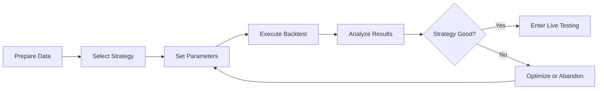

# Lesson 5: First Strategy Backtest

> 📚 **Course Series**: Complete Freqtrade Quantitative Trading Course
> 📖 **Section**: Part 2 - Backtesting Practice
> ⏱ **Duration**: 2 hours
> 🎯 **Difficulty**: ⭐⭐ Beginner

---

## 🎯 Learning Objectives

After completing this lesson, you will be able to:
- ✅ Understand what backtesting is and why we backtest
- ✅ Master basic backtesting command usage
- ✅ Read and understand various metrics in backtest reports
- ✅ Identify and resolve common backtesting errors
- ✅ Evaluate whether a strategy is worth further research

---

## 📋 Prerequisites

### Required Conditions
- [x] Completed lessons 1-4
- [x] Freqtrade environment installed and configured
- [x] Downloaded at least 30 days of historical data

### Environment Verification
```bash
# 1. Activate environment
conda activate freqtrade

# 2. Verify version
freqtrade --version
# Should show: freqtrade 2025.9 or higher

# 3. Verify strategy is available
freqtrade list-strategies -c config.json | grep Strategy001
# Should show: │ Strategy001 │ Strategy001.py │ OK │

# 4. Verify data is downloaded
freqtrade list-data -c config.json
# Should show downloaded trading pairs and timeframes
```

If any step has issues, please return to the corresponding lesson for review.

---

## 📖 Theoretical Knowledge

### 5.1 What is Backtesting?

**Backtesting** is the process of simulating trading strategies using historical data, aimed at evaluating the strategy's past performance.

#### How Backtesting Works

```
Historical Data → Strategy Logic → Simulated Trading → Performance Report
    ↓          ↓          ↓          ↓
  Candle Data   Buy/Sell Signals   Position Records   Profit Statistics
```

**Example Explanation**:
- Assume today is 2025-09-30
- We use historical data from 2025-09-01 to 2025-09-30
- Simulate what would happen if the strategy ran during these 30 days
- Statistics on profit/loss, win rate, maximum drawdown, etc.

#### Backtesting vs Live Trading Differences

| Dimension | Backtesting | Live Trading |
|-----------|-------------|--------------|
| Data | Historical data (known) | Real-time data (unknown) |
| Execution | Instant completion | Real waiting |
| Slippage | May be ignored | Actually exists |
| Fees | Estimated | Actually deducted |
| Psychology | No pressure | Emotional fluctuations |

⚠️ **Important Note**: Good backtesting doesn't guarantee good live trading, but poor backtesting definitely means poor live trading!

---

### 5.2 Why Backtest?

#### 5 Key Reasons

1. **Verify Strategy Logic**
   - Is the strategy concept correct?
   - Are buy/sell signals reasonable?

2. **Evaluate Profitability**
   - Can it make money? How much?
   - What's the win rate?

3. **Assess Risk Level**
   - What's the maximum drawdown?
   - Can it be tolerated?

4. **Optimize Parameters**
   - Which parameters work better?
   - How to adjust stop-loss and take-profit?

5. **Build Confidence**
   - Only use real money after strategy validation

#### Limitations of Backtesting

❌ **What backtesting cannot do**:
- Cannot predict the future (history doesn't exactly repeat)
- Cannot eliminate all risks
- Cannot replace live trading verification

✅ **What backtesting can do**:
- Quickly screen strategies
- Discover obvious problems
- Provide optimization directions

---

### 5.3 Basic Backtesting Process



---

## 💻 Practical Operations

### 5.4 First Backtest Command

#### Command Structure

```bash
freqtrade backtesting \
  -c config.json \                    # Configuration file
  --strategy Strategy001 \            # Strategy name
  --timerange 20250901-20250930       # Time range
```

#### Step-by-Step Execution

**Step 1: Activate Environment**
```bash
conda activate freqtrade
cd /path/to/freqtrade-strategies
```

**Step 2: Verify Data**
```bash
# Ensure data is downloaded
freqtrade list-data -c config.json

# Sample output:
# BTC/USDT  5m  2025-09-01 -> 2025-09-30
# ETH/USDT  5m  2025-09-01 -> 2025-09-30
```

**Step 3: Execute Backtest**
```bash
freqtrade backtesting \
  -c config.json \
  --strategy Strategy001 \
  --timerange 20250901-20250930
```

#### Execution Process Explanation

After starting the backtest, you'll see output similar to this:

```
2025-09-30 16:00:00 - freqtrade - INFO - freqtrade 2025.9
2025-09-30 16:00:01 - freqtrade.configuration - INFO - Using config: config.json ...
2025-09-30 16:00:02 - freqtrade.exchange - INFO - Using Exchange "Binance"
2025-09-30 16:00:03 - freqtrade.optimize.backtesting - INFO - Loading data from 2025-09-01 to 2025-09-30
2025-09-30 16:00:04 - freqtrade.optimize.backtesting - INFO - Running backtesting for Strategy Strategy001
```

**Execution Time**:
- 1 month data: about 5-30 seconds
- 3 months data: about 30-60 seconds
- 1 year data: about 2-5 minutes

---

### 5.5 Complete Backtest Report Interpretation

After backtesting completes, multiple tables will be displayed. Let's interpret them one by one:

#### 📊 Table 1: BACKTESTING REPORT (Core Report)

```
                               BACKTESTING REPORT
┏━━━━━━━━━━┳━━━━━━━━┳━━━━━━━━━━━━━━┳━━━━━━━━━━━━━━━━━┳━━━━━━━━━━━━━━┳━━━━━━━━━━━━━━━━━━┳━━━━━━━━━━━━━━━━━━━━━━━━┓
┃     Pair ┃ Trades ┃ Avg Profit % ┃ Tot Profit USDT ┃ Tot Profit % ┃     Avg Duration ┃  Win  Draw  Loss  Win% ┃
┡━━━━━━━━━━╇━━━━━━━━╇━━━━━━━━━━━━━━╇━━━━━━━━━━━━━━━━━╇━━━━━━━━━━━━━━╇━━━━━━━━━━━━━━━━━━╇━━━━━━━━━━━━━━━━━━━━━━━━┩
│ BTC/USDT │      7 │         0.52 │           3.643 │         0.36 │ 3 days, 20:05:00 │    6     0     1  85.7 │
│ ETH/USDT │      6 │        -0.98 │          -5.897 │        -0.59 │  4 days, 5:28:00 │    5     0     1  83.3 │
│ BNB/USDT │     10 │         0.92 │           9.137 │         0.91 │  2 days, 7:17:00 │   10     0     0   100 │
│ SOL/USDT │     17 │        -0.29 │          -4.912 │        -0.49 │   1 day, 3:23:00 │   15     0     2  88.2 │
│ XRP/USDT │     16 │         0.21 │           3.366 │         0.34 │   1 day, 9:40:00 │   14     0     2  87.5 │
│    TOTAL │     56 │          0.1 │           5.338 │         0.53 │  2 days, 2:11:00 │   50     0     6  89.3 │
└──────────┴────────┴──────────────┴─────────────────┴──────────────┴──────────────────┴────────────────────────┘
```

**Column-by-Column Explanation**:

1. **Pair (Trading Pair)**
   - Individual performance for each trading pair
   - TOTAL row is the summary of all trading pairs

2. **Trades (Number of Trades)**
   - Number of completed trades
   - ⚠️ Too few (<10): Insufficient sample, unreliable
   - ✅ Moderate (10-100): Reasonable
   - ⚠️ Too many (>200): Possible overtrading

3. **Avg Profit % (Average Return Rate)**
   - Average profit/loss percentage per trade
   - **Example**: 0.52% means average profit of 0.52% per trade
   - ✅ > 0.5%: Good
   - ⚠️ < 0.1%: May lose money after fees

4. **Tot Profit USDT (Total Profit USDT)**
   - Total profit/loss for the trading pair (unit: USDT)
   - **Example**: BTC/USDT earned 3.643 USDT

5. **Tot Profit % (Total Return Rate)**
   - Total return rate relative to initial capital
   - **Calculation**: Total profit/loss / Initial capital
   - **Example**: 0.36% means earned 3.6 USDT from 1000 USDT

6. **Avg Duration (Average Position Time)**
   - Average holding time per trade
   - **Example**: 3 days, 20:05:00 = 3 days 20 hours 5 minutes
   - ⚠️ Too long: Low capital utilization, overnight risk
   - ⚠️ Too short: High fee percentage

7. **Win Draw Loss Win% (Win/Loss Statistics)**
   - **Win**: Number of profitable trades
   - **Draw**: Number of breakeven trades
   - **Loss**: Number of losing trades
   - **Win%**: Win rate = Win / (Win + Loss)
   - **Example**: 6 wins, 0 draws, 1 loss, 85.7% win rate

**Key Observations**:
- ✅ BNB/USDT performed best: 10 trades all wins, total return +0.91%
- ❌ ETH/USDT performed worst: Total return -0.59%
- ✅ Overall performance: 56 trades, 50 wins 6 losses, 89.3% win rate, total return +0.53%

---

#### 📊 Table 2: LEFT OPEN TRADES REPORT (Open Positions Report)

```
                                LEFT OPEN TRADES REPORT
┏━━━━━━━━━━┳━━━━━━━━┳━━━━━━━━━━━━━━┳━━━━━━━━━━━━━━━━━┳━━━━━━━━━━━━━━┳━━━━━━━━━━━━━━━━━━━┳━━━━━━━━━━━━━━━━━━━━━━━━┓
┃     Pair ┃ Trades ┃ Avg Profit % ┃ Tot Profit USDT ┃ Tot Profit % ┃      Avg Duration ┃  Win  Draw  Loss  Win% ┃
┡━━━━━━━━━━╇━━━━━━━━╇━━━━━━━━━━━━━━╇━━━━━━━━━━━━━━━━━╇━━━━━━━━━━━━━━╇━━━━━━━━━━━━━━━━━━━╇━━━━━━━━━━━━━━━━━━━━━━━━┩
│ ETH/USDT │      1 │         0.28 │           0.277 │         0.03 │  7 days, 10:40:00 │    1     0     0   100 │
│ BNB/USDT │      1 │         0.17 │           0.167 │         0.02 │  7 days, 10:30:00 │    1     0     0   100 │
│ XRP/USDT │      1 │        -0.76 │          -0.762 │        -0.08 │           4:10:00 │    0     0     1     0 │
│ BTC/USDT │      1 │        -2.33 │          -2.313 │        -0.23 │ 12 days, 21:25:00 │    0     0     1     0 │
│    TOTAL │      4 │        -0.66 │          -2.631 │        -0.26 │  6 days, 23:41:00 │    2     0     2  50.0 │
└──────────┴────────┴──────────────┴─────────────────┴──────────────┴───────────────────┴────────────────────────┘
```

**Meaning**:
- Trades still open when backtesting ended
- These trades are not included in the total profit above
- ⚠️ **Note**: Open trades may be losing (like BTC/USDT -2.33%)

**Why are there open trades?**
- Strategy is still waiting for sell signals
- Backtest time ended but trades aren't completed
- These trades would continue in live trading

**How to evaluate?**
- Few open positions (<5): Normal
- Overall loss on open positions: Need attention, strategy exit conditions may be too strict

---

#### 📊 Table 3: ENTER TAG STATS (Entry Tag Statistics)

```
                                ENTER TAG STATS
┏━━━━━━━━━━━┳━━━━━━━━━┳━━━━━━━━━━━━━━┳━━━━━━━━━━━━━━━━━┳━━━━━━━━━━━━━━┳━━━━━━━━━━━━━━━━━┳━━━━━━━━━━━━━━━━━━━━━━━━┓
┃ Enter Tag ┃ Entries ┃ Avg Profit % ┃ Tot Profit USDT ┃ Tot Profit % ┃    Avg Duration ┃  Win  Draw  Loss  Win% ┃
┡━━━━━━━━━━━╇━━━━━━━━━╇━━━━━━━━━━━━━━╇━━━━━━━━━━━━━━━━━╇━━━━━━━━━━━━━━╇━━━━━━━━━━━━━━━━━╇━━━━━━━━━━━━━━━━━━━━━━━━┩
│     OTHER │      56 │          0.1 │           5.338 │         0.53 │ 2 days, 2:11:00 │   50     0     6  89.3 │
│     TOTAL │      56 │          0.1 │           5.338 │         0.53 │ 2 days, 2:11:00 │   50     0     6  89.3 │
└───────────┴─────────┴──────────────┴─────────────────┴──────────────┴─────────────────┴────────────────────────┘
```

**Meaning**:
- Statistics classified by entry reason
- Strategy001 marks all entries as "OTHER" (default tag)
- Advanced strategies can set multiple entry tags, showing which entry method works better

**Example (Advanced Strategy)**:
```
Enter Tag    | Entries | Avg Profit %
-------------+---------+--------------
breakout     |      20 |         1.2%  ← Breakout entry performs well
oversold     |      15 |        -0.5%  ← Oversold entry performs poorly
```

---

#### 📊 Table 4: EXIT REASON STATS (Exit Reason Statistics)

```
                                 EXIT REASON STATS
┏━━━━━━━━━━━━━┳━━━━━━━┳━━━━━━━━━━━━━━┳━━━━━━━━━━━━━━━━━┳━━━━━━━━━━━━━━┳━━━━━━━━━━━━━━━━━━━┳━━━━━━━━━━━━━━━━━━━━━━━━┓
┃ Exit Reason ┃ Exits ┃ Avg Profit % ┃ Tot Profit USDT ┃ Tot Profit % ┃      Avg Duration ┃  Win  Draw  Loss  Win% ┃
┡━━━━━━━━━━━━━╇━━━━━━━╇━━━━━━━━━━━━━━╇━━━━━━━━━━━━━━━━━╇━━━━━━━━━━━━━━╇━━━━━━━━━━━━━━━━━━━╇━━━━━━━━━━━━━━━━━━━━━━━━┩
│         roi │     48 │         1.01 │          48.639 │         4.86 │  1 day, 10:01:00  │   48     0     0   100 │
│  force_exit │      4 │        -0.66 │          -2.631 │        -0.26 │  6 days, 23:41:00  │    2     0     2  50.0 │
│   stop_loss │      4 │       -10.18 │         -40.670 │        -4.07 │  5 days, 6:40:00  │    0     0     4     0 │
│       TOTAL │     56 │          0.1 │           5.338 │         0.53 │  2 days, 2:11:00  │   50     0     6  89.3 │
└─────────────┴───────┴──────────────┴─────────────────┴──────────────┴───────────────────┴────────────────────────┘
```

**This is one of the most important tables!** Tells you how trades ended.

**Exit Reason Explanations**:

1. **roi (Take Profit)**
   - Automatically take profit when ROI target is reached
   - **Example**: 48 trades took profit through ROI, average return +1.01%
   - ✅ Excellent performance: All profitable

2. **exit_signal (Signal Sell)**
   - Strategy generates sell signal
   - **Example**: Not present in this backtest
   - 📝 Strategy001 uses `exit_profit_only = True`, only responds to sell signals when profitable

3. **stop_loss (Stop Loss)**
   - Stop loss triggered
   - **Example**: 4 stop losses, average loss -10.18%
   - ⚠️ **Warning**: High stop loss ratio indicates strategy is risky

4. **force_exit (Force Close)**
   - Open positions at backtest end are forcibly closed
   - **Example**: 4 trades, average -0.66%
   - 📝 These are the trades from the "Open Positions Report" above

**Key Observations**:
- ✅ Most trades (48/56 = 85.7%) took profit through ROI
- ⚠️ 4 stop losses caused -40.670 USDT in losses
- 📊 Without stop losses, total return would be +46 USDT (5.338 + 40.670)

---

#### 📊 Table 5: SUMMARY METRICS (Summary Metrics)

```
                          SUMMARY METRICS
┏━━━━━━━━━━━━━━━━━━━━━━━━━━━━━━━┳━━━━━━━━━━━━━━━━━━━━━━━━━━━━━━━━━┓
┃ Metric                        ┃ Value                           ┃
┡━━━━━━━━━━━━━━━━━━━━━━━━━━━━━━━╇━━━━━━━━━━━━━━━━━━━━━━━━━━━━━━━━━┩
│ Backtesting from              │ 2025-09-01 00:00:00             │
│ Backtesting to                │ 2025-09-30 00:00:00             │
│ Trading Mode                  │ Spot                            │
│ Max open trades               │ 5                               │
│                               │                                 │
│ Total/Daily Avg Trades        │ 56 / 1.93                       │
│ Starting balance              │ 1000 USDT                       │
│ Final balance                 │ 1005.338 USDT                   │
│ Absolute profit               │ 5.338 USDT                      │
│ Total profit %                │ 0.53%                           │
│ CAGR %                        │ 6.93%                           │
│ Sortino                       │ 0.86                            │
│ Sharpe                        │ 1.22                            │
│ Calmar                        │ 9.71                            │
│ SQN                           │ 0.24                            │
│ Profit factor                 │ 1.12                            │
│ Expectancy (Ratio)            │ 0.10 (0.01)                     │
│ Avg. daily profit             │ 0.184 USDT                      │
│ Avg. stake amount             │ 99.739 USDT                     │
│ Total trade volume            │ 11198.536 USDT                  │
│                               │                                 │
│ Best Pair                     │ BNB/USDT 0.91%                  │
│ Worst Pair                    │ ETH/USDT -0.59%                 │
│ Best trade                    │ SOL/USDT 1.45%                  │
│ Worst trade                   │ SOL/USDT -10.18%                │
│ Best day                      │ 7.981 USDT                      │
│ Worst day                     │ -29.492 USDT                    │
│ Days win/draw/lose            │ 19 / 8 / 3                      │
│ Min/Max/Avg. Duration Winners │ 0d 01:00 / 8d 02:35 / 1d 15:48  │
│ Min/Max/Avg. Duration Losers  │ 0d 04:10 / 12d 21:25 / 5d 16:42 │
│ Max Consecutive Wins / Loss   │ 40 / 3                          │
│ Rejected Entry signals        │ 0                               │
│ Entry/Exit Timeouts           │ 0 / 0                           │
│                               │                                 │
│ Min balance                   │ 1000.996 USDT                   │
│ Max balance                   │ 1040.2 USDT                     │
│ Max % of account underwater   │ 3.62%                           │
│ Absolute drawdown             │ 37.676 USDT (3.62%)             │
│ Drawdown duration             │ 4 days 07:15:00                 │
│ Profit at drawdown start      │ 40.2 USDT                       │
│ Profit at drawdown end        │ 2.524 USDT                      │
│ Drawdown start                │ 2025-09-21 03:50:00             │
│ Drawdown end                  │ 2025-09-25 11:05:00             │
│ Market change                 │ 6.66%                           │
└───────────────────────────────┴─────────────────────────────────┘
```

**Core Metrics Detailed Explanation**:

**📈 Profit Metrics**
- **Total profit %**: Total return rate 0.53%
  - 1000 USDT → 1005.338 USDT
- **CAGR %**: Annualized return rate 6.93%
  - If this return rate continues for a year, annualized return 6.93%
  - ⚠️ Note: This is just 1 month of data annualized, doesn't represent real annualized return
- **Avg. daily profit**: Average daily profit 0.184 USDT
  - Average profit of 0.184 USDT per day

**📊 Risk Metrics**
- **Max % of account underwater (Maximum Drawdown)**: 3.62%
  - Maximum decline from highest point to lowest point
  - **Example**: Account highest 1040.2 USDT, lowest fell to 1002.524 USDT
  - **Calculation**: (1040.2 - 1002.524) / 1040.2 = 3.62%
  - ✅ < 10%: Controllable risk
  - ⚠️ 10-20%: Moderate risk
  - ❌ > 20%: High risk

- **Sharpe Ratio**: 1.22
  - Risk-adjusted return metric
  - ✅ > 1.0: Good
  - ✅ > 2.0: Excellent
  - ❌ < 0: Loss

- **Sortino Ratio**: 0.86
  - Similar to Sharpe, but only considers downside risk
  - ✅ > 1.0: Good

**📉 Win/Loss Statistics**
- **Win rate**: 89.3% (50 wins / 56 trades)
  - ✅ > 60%: Good
  - ⚠️ < 50%: Need to improve profit/loss ratio

- **Profit factor**: 1.12
  - Total profit / Total loss
  - **Calculation**: (48.639 + ...other profits) / (40.670 + ...other losses)
  - ✅ > 1.5: Excellent
  - ✅ > 1.0: Profitable
  - ❌ < 1.0: Loss

- **Max Consecutive Wins / Loss**: 40 consecutive wins / 3 consecutive losses
  - Longest winning and losing streaks
  - ⚠️ Long losing streaks can affect psychology

**🔍 Other Key Metrics**
- **Best trade / Worst trade**: +1.45% / -10.18%
  - Best and worst single trades
  - **Risk Warning**: Worst trade -10.18% = strategy's stoploss

- **Days win/draw/lose**: 19 profitable days / 8 breakeven / 3 losing days
  - Daily profit/loss statistics
  - 📊 19 out of 30 days were profitable

- **Market change**: 6.66%
  - Market increase during same period
  - **Comparison**: Strategy earned 0.53%, market rose 6.66%
  - ⚠️ **Underperformed market**! Simply holding BTC might have been better

---

### 5.6 How to Judge Strategy Quality?

Based on this backtest report, let's evaluate Strategy001:

#### ✅ Advantages
1. **High win rate**: 89.3%, very stable
2. **Small drawdown**: 3.62%, controllable risk
3. **High take-profit efficiency**: 85.7% of trades took profit through ROI
4. **Sharpe > 1**: Good risk-adjusted returns

#### ❌ Disadvantages
1. **Low returns**: 0.53%, underperformed market (6.66%)
2. **Large stop loss**: -10% stop loss causes large single losses
3. **Long holding time**: Average 2 days, low capital utilization
4. **Small sample**: Only 56 trades

#### 🎯 Overall Evaluation
**Rating**: ⭐⭐⭐ / ⭐⭐⭐⭐⭐

**Applicable Scenarios**:
- ✅ Conservative investors
- ✅ Range-bound markets
- ❌ Bull markets (underperforms market)
- ❌ Pursuing high returns

**Recommendations**:
1. Can try Dry-run verification
2. Need to optimize stop-loss strategy
3. Consider reducing holding time
4. Not recommended in bull markets

---

## 🐛 Common Errors and Solutions

### Error 1: No data found

```
ERROR - No data found. Terminating.
```

**Causes**:
- Timeframe mismatch (strategy uses 5m, but only 1h data downloaded)
- No data in time range

**Solution**:
```bash
# Check timeframe used by strategy
grep "timeframe" user_data/strategies/Strategy001.py
# Output: timeframe = '5m'

# Download corresponding data
freqtrade download-data -c config.json --days 30 --timeframes 5m
```

---

### Error 2: Strategy not found

```
ERROR - Impossible to load Strategy 'Strategy001'
```

**Causes**:
- Strategy name spelling error
- Strategy file not in strategies directory

**Solution**:
```bash
# List all available strategies
freqtrade list-strategies -c config.json

# Confirm strategy name (case sensitive)
```

---

### Error 3: Timeframe mismatch

```
ERROR - Timeframe '15m' is not available. Available: ['5m']
```

**Causes**:
- Backtest specified timeframe doesn't match downloaded data

**Solution**:
```bash
# Method 1: Download corresponding timeframe data
freqtrade download-data -c config.json --days 30 --timeframes 15m

# Method 2: Backtest using existing timeframe
freqtrade backtesting -c config.json --strategy Strategy001 --timeframe 5m
```

---

## 📝 Practical Tasks

### Task 1: Basic Backtesting (Required)

**Objective**: Complete your first backtest

```bash
# 1. Backtest Strategy001 (2025-09-01 to 2025-09-30)
freqtrade backtesting \
  -c config.json \
  --strategy Strategy001 \
  --timerange 20250901-20250930

# 2. Record the following metrics:
- Total trades: _______
- Win rate: _______
- Total return: _______
- Maximum drawdown: _______
- Sharpe Ratio: _______
```

**Submission**:
- [ ] Backtest report screenshot
- [ ] Key metrics record table
- [ ] Your strategy evaluation (100-200 words)

---

### Task 2: Error Diagnosis (Optional)

**Objective**: Familiarize with common errors and solutions

Try executing the following "error" commands, observe error messages, and fix them:

```bash
# Error 1: Non-existent strategy
freqtrade backtesting -c config.json --strategy NotExistStrategy

# Error 2: Non-existent trading pair
# First edit config.json, add "FAKE/USDT" to pair_whitelist

# Error 3: Timeframe without downloaded data
freqtrade backtesting -c config.json --strategy Strategy001 --timeframe 1h

# For each error:
# 1. Record error message
# 2. Analyze cause
# 3. Write solution
```

---

### Task 3: Comparative Analysis (Advanced)

**Objective**: Compare backtest results from different time ranges

```bash
# Backtest 1 month
freqtrade backtesting -c config.json --strategy Strategy001 --timerange 20250901-20250930

# Backtest 3 months (need to download data first)
freqtrade backtesting -c config.json --strategy Strategy001 --timerange 20250701-20250930
```

Create comparison table:

| Metric | 1 Month | 3 Months | Difference Analysis |
|--------|---------|-----------|---------------------|
| Number of trades | | | |
| Win rate | | | |
| Total return | | | |
| Maximum drawdown | | | |
| Sharpe | | | |

**Thinking Questions**:
1. Are the 1-month and 3-month results very different?
2. Which time range is more credible?
3. If differences are large, what does that indicate?

---

## 📚 Extended Reading

### Recommended Articles
- [Limitations of Backtesting](https://www.freqtrade.io/en/stable/backtesting/)
- [How to Avoid Overfitting](https://www.investopedia.com/terms/o/overfitting.asp)
- [Sharpe Ratio Explained](https://www.investopedia.com/terms/s/sharperatio.asp)

### Related Documentation
- 📄 [TESTING_GUIDE.md](../TESTING_GUIDE.md) - Complete Testing Guide
- 📄 [STRATEGY_SELECTION_GUIDE.md](../STRATEGY_SELECTION_GUIDE.md) - Strategy Selection Guide

---

## 🎓 Post-Class Quiz

### Multiple Choice

1. What is the main purpose of backtesting?
   - A. Predict future prices
   - B. Evaluate strategy historical performance
   - C. Guarantee live trading profits
   - D. Replace live trading

2. What happens with a 90% win rate but 1:10 profit/loss ratio strategy?
   - A. Big profits
   - B. Big losses
   - C. Breakeven
   - D. Cannot determine

3. What does maximum drawdown of 30% mean?
   - A. Maximum 30% loss per trade
   - B. Fell 30% from highest to lowest point
   - C. 70% win rate
   - D. 30% total loss

4. What does Sharpe Ratio < 0 indicate?
   - A. Strategy is profitable
   - B. Strategy is losing
   - C. Risk is too high
   - D. Insufficient data

5. Why doesn't good backtesting guarantee good live trading?
   - A. History doesn't repeat
   - B. Slippage and psychological factors exist
   - C. Possible overfitting
   - D. All of the above

### Calculation Problems

6. Initial capital 1000 USDT, final 1053 USDT, what is the total return rate?

7. 10 trades, 7 wins 3 losses, what is the win rate?

8. Account rose from 1000 to 1200, then fell to 1100, what is the maximum drawdown?

### Practical Problems

9. Please explain this backtest result:
   - Number of trades: 200
   - Win rate: 45%
   - Average profit: +2%
   - Average loss: -1%
   - Is this strategy profitable or losing?

10. If a strategy earns 50% in bull markets and loses 30% in bear markets, would you use it? Why?

**Answers at end** ⬇️

---

## ✅ Learning Checklist

Before proceeding to the next lesson, ensure you have:

- [ ] Understood what backtesting is and its purpose
- [ ] Able to execute basic backtesting commands
- [ ] Able to read and understand the 5 tables in backtest reports
- [ ] Know how to judge strategy quality
- [ ] Able to identify and resolve common errors
- [ ] Completed at least 3 backtests with different strategies/time ranges
- [ ] Understood limitations of backtesting

If you have any questions, please return to the corresponding section for review, or ask in the community.

---

## 🎯 Next Lesson Preview

**Lesson 6: Strategy Performance Analysis**

In Lesson 6, we will:
- Deep dive into how to evaluate strategy quality
- Master multi-dimensional strategy comparison methods
- Learn to create professional strategy comparison tables
- Understand the importance and weighting of different metrics

---

## 💬 Post-Class Discussion

### Thinking Questions
1. What do you think constitutes a "good strategy"?
2. If backtesting returns are high but drawdown is also large, would you use it?
3. Backtesting 1 month vs backtesting 1 year, which is more important?

### Share Your Backtest Results
Welcome to share in the community:
- Your first backtest results
- Problems encountered and solutions
- Evaluation of Strategy001

---

## 📌 Quiz Answers

1. B
2. B (9 small wins + 1 big loss = overall loss)
3. B
4. B
5. D
6. (1053 - 1000) / 1000 = 5.3%
7. 7 / 10 = 70%
8. (1200 - 1100) / 1200 = 8.33%
9. Profitable. Expected return = 45% × (-1%) + 55% × 2% = 0.65% > 0
10. No. Although it looks profitable, can't predict if future is bull or bear, too risky.

---

**Happy learning! Ready for Lesson 6?** 🚀

---

📝 **Course Feedback**: If any part of this lesson is unclear, feel free to provide suggestions!